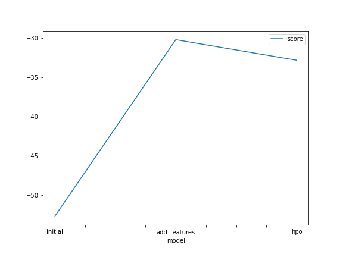
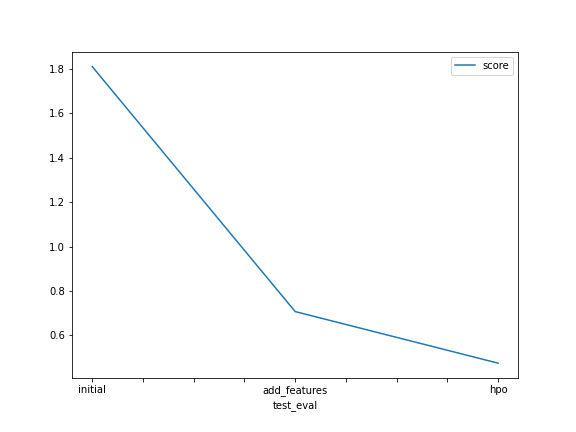

# Report: Predict Bike Sharing Demand with AutoGluon Solution
#### Lech Wołowski

## Initial Training
### What did you realize when you tried to submit your predictions? What changes were needed to the output of the predictor to submit your results?
Predictions need to be non-zero and saved to csv ffile

### What was the top ranked model that performed?
KNeighborsDist

## Exploratory data analysis and feature creation
### What did the exploratory analysis find and how did you add additional features?
Datetime feature was pretty useless in it's current form

### How much better did your model preform after adding additional features and why do you think that is?
It got way better - 0.53 vs 1.86. I added features that take into account month of the year and also hour. both these features changes the demand.

## Hyper parameter tuning
### How much better did your model preform after trying different hyper parameters?
Marginally better, I guess automatic hyperparameters were close to perfect

### If you were given more time with this dataset, where do you think you would spend more time?
I would spend more time on Exploratory data analysis. I think there is more to find in the data.

### Create a table with the models you ran, the hyperparameters modified, and the kaggle score.
|model|num_boost_round|num_leaves|num_trials|score|
|--|--|--|--|--|
|initial|default|default|default|1.86430|
|add_features|default|default|default|0.53706|
|hpo|100|range: 26-66 with default 36|5|0.51885|

### Create a line plot showing the top model score for the three (or more) training runs during the project.

### Create a line plot showing the top kaggle score for the three (or more) prediction submissions during the project.

## Summary
We find in here that Autogluon can make it easy for us to train multiple models on one dataset and find the best one automatically, but we still need to perform Exploratory data analysis like we would normally and it has a huge impact on model performance